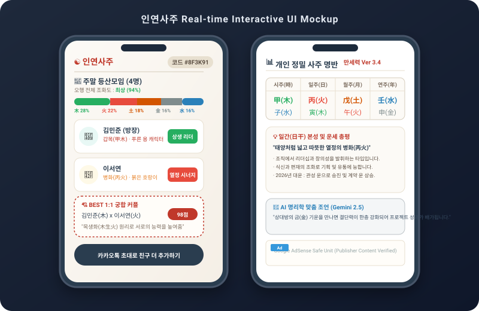

# 🔮 인연사주 (Inyeon Saju) - 우리들의 사용 설명서

> **태어난 날의 음양오행(陰陽五行) 기운으로 풀어보는 모임과 사람 사이의 인연 및 궁합 리포트**

[](https://reactjs.org/)
[](https://www.typescriptlang.org/)
[](https://tailwindcss.com/)
[](https://vitejs.dev/)
[](https://firebase.google.com/)
[](https://adsense.google.com/)

---

## 📌 프로젝트 소개 (Overview)

**인연사주(Inyeon Saju)**는 정통 동양 만세력(萬歲曆) 알고리즘과 음양오행(木·火·土·金·水) 생극제화(生克制化) 원리를 바탕으로, 카카오톡 단톡방, 동호회, 회사 팀 등 여러 사람이 모였을 때 발생하는 **그룹 케미스트리(Group Chemistry)**와 **1:1 속궁합**을 정밀 측정해 주는 웹 스페셜리티 서비스입니다.

태어난 연·월·일·시를 절기(節氣) 기준으로 정확히 측정하여 나만의 12간지 캐릭터와 일간(日干) 본성을 도출하며, 모임 코드 하나로 동료들과 손쉽게 사주 궁합을 공유하고 소통할 수 있습니다.

---

## 📱 실제 사용 화면 프리뷰 (UI & Code Mockup Preview)

### 1. 모바일 앱 인터페이스 SVG 프리뷰

<div align="center">
  
</div>

---

### 2. 코드 및 컴포넌트 아키텍처 프리뷰 (Code Architecture)

```tsx
// src/components/GroupView.tsx - 그룹 사주 분석 및 1:1 궁합 리포트 렌더링
import React from 'react';
import { calculateFiveElements, getChemistryMatrix } from '../lib/sajuCalculator';
import GoogleAds from './GoogleAds';

export function GroupView({ members, roomCode }: { members: Member[]; roomCode: string }) {
  const elementsDistribution = calculateFiveElements(members);
  const chemistryReport = getChemistryMatrix(members);

  return (
    <div className="max-w-md mx-auto space-y-6 p-4 bg-[#FCFAF6]">
      {/* 1. 그룹 헤더 & 오행 분포 그래프 */}
      <section className="bg-white p-5 rounded-2xl border border-[#D6CCBC] shadow-xs">
        <h2 className="text-sm font-bold text-[#2C3E50] font-serif">👥 그룹 오행 조화도</h2>
        <div className="mt-3 flex h-3 rounded-full overflow-hidden">
          <div style={{ width: `${elementsDistribution.wood}%` }} className="bg-[#27AE60]" />
          <div style={{ width: `${elementsDistribution.fire}%` }} className="bg-[#E74C3C]" />
          <div style={{ width: `${elementsDistribution.earth}%` }} className="bg-[#D35400]" />
          <div style={{ width: `${elementsDistribution.metal}%` }} className="bg-[#7F8C8D]" />
          <div style={{ width: `${elementsDistribution.water}%` }} className="bg-[#2980B9]" />
        </div>
      </section>

      {/* 2. 1:1 궁합 매칭 매트릭스 */}
      <section className="space-y-3">
        {chemistryReport.matches.map((match) => (
          <div key={match.id} className="p-4 bg-white rounded-xl border border-[#E8E0D0] flex justify-between">
            <div>
              <span className="text-xs font-bold text-[#C0392B]">{match.pairNames}</span>
              <p className="text-[11px] text-[#7A6B5D]">{match.description}</p>
            </div>
            <span className="px-2.5 py-1 bg-[#C0392B] text-white text-xs font-bold rounded-lg h-fit">
              {match.score}점
            </span>
          </div>
        ))}
      </section>

      {/* 3. Google AdSense 정책 준수 유닛 (콘텐츠 검증 완료 시에만 노출) */}
      <GoogleAds layout="banner" hasContent={members.length >= 2} />
    </div>
  );
}
```

---

## ✨ 핵심 기능 (Key Features)

| 기능 | 상세 설명 |
| :--- | :--- |
| **🔮 정통 만세력 & 12간지 캐릭터** | 양력/음력/윤달 절기 시각 정밀 변환, 야자시·조자시 구분을 반영한 사주팔자 및 소동물 캐릭터 생성 |
| **👥 그룹 궁합 & 케미스트리 매트릭스** | 6자리 모임 코드로 손쉬운 초대, 오행 분포 그래프 및 구성원 간 상생·상극 궁합 리포트 연동 |
| **📊 나만의 사주 심층 리포트 (MeView)** | 일간(日干) 본성, 십성(十星) 구조, 자미두수(紫微斗數) 명반 연동 개인 운세 및 맞춤 AI 조언 |
| **📜 명리학 학술 칼럼 Archive** | 십성 심리학, 자미두수 대운, 오행 균형 완화론 등 고품질 학술 칼럼 4편 및 FAQ 제공 |
| **💳 프리미엄 샵 (Lemon Squeezy)** | 엽전/포인트 충전 오버레이 연동 및 서비스 이용 결제 지원 |
| **📲 카카오톡 아웃링크 스마트 가이드** | 카카오톡 인앱 브라우저 진입 시 사파리/크롬 외부 브라우저 자동 연결 안내 |
| **🛡️ AdSense 정책 엄격 준수** | 게시자 콘텐츠가 없는 유령 화면 광고 완전 차단 및 맞춤형 광고 거부 쿠키 고지 준수 |

---

## 🏛️ 기술 스택 (Tech Stack)

```
┌─────────────────────────────────────────────────────────────┐
│                       Frontend Stack                        │
│   React 18  │  TypeScript  │  Tailwind CSS  │  Motion      │
├─────────────────────────────────────────────────────────────┤
│                      Backend & Database                     │
│   Firebase Firestore  │  Firebase Auth  │  Express / Node   │
├─────────────────────────────────────────────────────────────┤
│                     External Integrations                   │
│   Lemon Squeezy API   │  Google AdSense │  Google Gemini    │
└─────────────────────────────────────────────────────────────┘
```

- **Core Framework**: React 18, Vite 5, TypeScript
- **Styling & UI**: Tailwind CSS, Lucide Icons, Custom Oriental Color Palette (`#FCFAF6`, `#2C3E50`, `#C0392B`)
- **Backend & Storage**: Firebase Firestore (Realtime Data Sync), Firebase Authentication
- **Monetization & Ads**: Google AdSense (Auto-Ads / Banner Units with Content Validation) & Lemon Squeezy Payment Overlay

---

## 📜 구글 애드센스(Google AdSense) 승인 가이드라인 준수

본 서비스는 Google AdSense 품질 지침 및 정책을 엄격히 준수하도록 설계되었습니다.

1. **게시자 콘텐츠 유무 검증 (`hasContent` Guard)**
   - 개인 분석 리포트나 그룹 분석 결과가 출력되지 않은 빈 화면(로딩 중, 단순 회원가입 폼)에는 광고 스크립트 호출을 원천 차단하여 **"게시자 콘텐츠가 없는 화면에 Google 게재 광고"** 위반을 방지합니다.
2. **고품질 학술 메인 콘텐츠 탑재**
   - 랜딩 페이지 하단에 명리학 학술 칼럼 4편과 종합 FAQ, 정통 만세력 작동 원리를 수록하여 **"가치가 별로 없는 콘텐츠"** 반려 이슈를 해결했습니다.
3. **필수 법적 모달 고지**
   - `개인정보처리방침`, `이용약관`, `광고 및 쿠키 정책` 모달을 상시 제공하며 Google AdSense 맞춤형 광고 쿠키 거부 수단을 명시했습니다.

---

## 📁 프로젝트 구조 (Directory Structure)

```text
├── index.html                  # HTML 메인 엔트리 (AdSense meta/script 포함)
├── src/
│   ├── App.tsx                 # 메인 애플리케이션 라우터 및 상태 관리
│   ├── main.tsx                # React Root 렌더러
│   ├── index.css               # 글로벌 Tailwind CSS 정의
│   ├── components/             # 모듈화된 UI 컴포넌트
│   │   ├── LandingView.tsx     # 메인 랜딩, 모임 생성/참여 및 학술 칼럼 모달
│   │   ├── RoomView.tsx        # 그룹 대기실 및 멤버 리스트
│   │   ├── GroupView.tsx       # 그룹 전체 궁합 매트릭스 & 오행 분석 리포트
│   │   ├── MeView.tsx          # 개인 정밀 사주 & 십성 분석 리포트
│   │   ├── GoogleAds.tsx       # 콘텐츠 검증 기반 안전한 AdSense 컴포넌트
│   │   ├── SajuForm.tsx        # 생년월일시 입력 폼
│   │   ├── SajuVisual.tsx      # 오행 차트 및 캐릭터 비주얼
│   │   ├── PremiumPaywall.tsx  # Lemon Squeezy 결제 샵 모달
│   │   └── ...
│   └── lib/                    # 파이어베이스 및 만세력 계산 유틸리티
└── metadata.json               # 앱 정보 및 주요 권한 설정
```

---

## 🔒 개인정보 및 보안

- 모든 유저 사주 정보는 Firestore 데이터베이스에 암호화되어 관리됩니다.
- 모임 방 탈퇴 및 프로필 삭제 시 유저 정보는 안전하게 영구 파기됩니다.

---

© 2026 **인연사주 (Inyeon Saju)**. All Rights Reserved.
